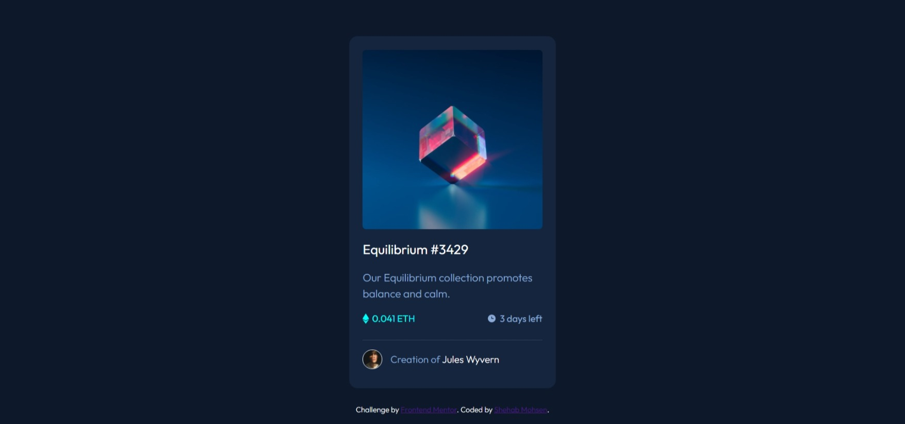

# Frontend Mentor - NFT preview card component solution

This is a solution to the [NFT preview card component challenge on Frontend Mentor](https://www.frontendmentor.io/challenges/nft-preview-card-component-SbdUL_w0U). Frontend Mentor challenges help you improve your coding skills by building realistic projects.

## Table of contents

- [The challenge](#the-challenge)
- [Screenshot](#screenshot)
- [Links](#links)
- [Built with](#built-with)
- [What I learned](#what-i-learned)
- [Continued development](#continued-development)
- [Author](#author)

### The challenge

Users should be able to:

- View the optimal layout depending on their device's screen size
- See hover states for interactive elements

### Screenshot

### Links

- Solution URL: [Add solution URL here](https://github.com/shehab20089/nft-card-component)
- Live Site URL: [Add live site URL here](https://quirky-bartik-b8d223.netlify.app/)

### Built with

- HTML
- CSS
- Flexbox

### What I learned

I learned the hovering effect on the image using css only without javascript as i usually did.

### Continued development

WIll focus on responsive design

## Author

- Frontend Mentor - [@shehab20089](https://www.frontendmentor.io/profile/shehab20089)
- LinkedIn - [@Shehab Mohsen](https://www.linkedin.com/in/shehab-mohsen-6ba984168/)
